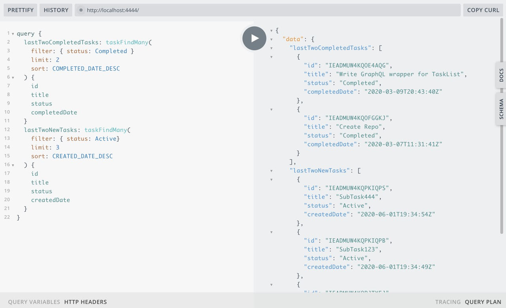

## Операция

За 1 http-запрос получить набор:
- последние 2 выполненных таска
- последние 3 новых таска

(под капотом, 2 запроса к РЕСТ АПИ выполняются параллельно)



## Запрос

```graphql
query {
  lastTwoCompletedTasks: taskFindMany(
    filter: { status: Completed }
    limit: 2
    sort: COMPLETED_DATE_DESC
  ) {
    id
    title
    status
    completedDate
  }
  lastTwoNewTasks: taskFindMany(
    filter: { status: Active}
    limit: 3
    sort: CREATED_DATE_DESC
  ) {
    id
    title
    status
    createdDate
  }
}
```

## Данные

```json
{
  "data": {
    "lastTwoCompletedTasks": [
      {
        "id": "IEADMUW4KQOE4AQG",
        "title": "Write GraphQL wrapper for TaskList",
        "status": "Completed",
        "completedDate": "2020-03-09T20:43:40Z"
      },
      {
        "id": "IEADMUW4KQOFGGKJ",
        "title": "Create Repo",
        "status": "Completed",
        "completedDate": "2020-03-07T11:31:41Z"
      }
    ],
    "lastTwoNewTasks": [
      {
        "id": "IEADMUW4KQPKIQPS",
        "title": "SubTask444",
        "status": "Active",
        "createdDate": "2020-06-01T19:34:54Z"
      },
      {
        "id": "IEADMUW4KQPKIQPB",
        "title": "SubTask123",
        "status": "Active",
        "createdDate": "2020-06-01T19:34:49Z"
      },
      {
        "id": "IEADMUW4KQPJTY5J",
        "title": "Sub-task2",
        "status": "Active",
        "createdDate": "2020-05-31T19:47:49Z"
      }
    ]
  },
  "extensions": {
    "complexity": 20,
    "maxComplexity": 10000
  }
}
```

## Лог REST API вызовы

```bash
  axios:request ⬜️  get https://www.wrike.com/api/v4/tasks?status=Completed&limit=2&sortField=CompletedDate&sortOrder=Desc
  axios:request ⬜️  get https://www.wrike.com/api/v4/tasks?status=Active&limit=3&sortField=CreatedDate&sortOrder=Desc +1ms
  axios:request ✅  get /tasks
  axios:request     status=Active
  axios:request     limit=3
  axios:request     sortField=CreatedDate
  axios:request     sortOrder=Desc +2s
  axios:request ✅  get /tasks
  axios:request     status=Completed
  axios:request     limit=2
  axios:request     sortField=CompletedDate
  axios:request     sortOrder=Desc +19ms
```
