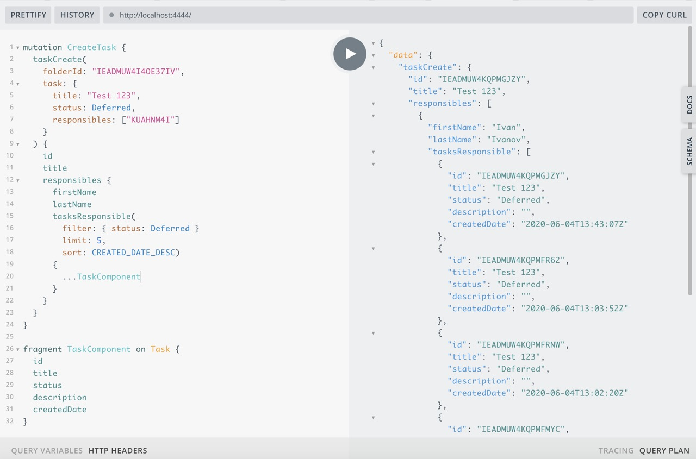

## Операция

За 1 http запрос выполнить операцию создания таска, и получение нового состояния с сервера, на примере - выдернуть последние 5 Deffered тасков отсортированных по дате создания.



## Запрос

```graphql
mutation CreateTask {
  taskCreate(
    folderId: "IEADMUW4I4OE37IV",
    task: {
      title: "Test 123",
      status: Deferred,
      responsibles: ["KUAHNM4I"]
    }
  ) {
    id
    title
    responsibles {
      firstName
      lastName
      tasksResponsible(
        filter: { status: Deferred } 
        limit: 5, 
        sort: CREATED_DATE_DESC) 
      {
        ...TaskComponent
      }
    }
  }
}

fragment TaskComponent on Task {
  id
  title
  status
  description
  createdDate
}
```

## Ответ

```json
{
  "data": {
    "taskCreate": {
      "id": "IEADMUW4KQPMGJZY",
      "title": "Test 123",
      "responsibles": [
        {
          "firstName": "Ivan",
          "lastName": "Ivanov",
          "tasksResponsible": [
            {
              "id": "IEADMUW4KQPMGJZY",
              "title": "Test 123",
              "status": "Deferred",
              "description": "",
              "createdDate": "2020-06-04T13:43:07Z"
            },
            {
              "id": "IEADMUW4KQPMFR62",
              "title": "Test 123",
              "status": "Deferred",
              "description": "",
              "createdDate": "2020-06-04T13:03:52Z"
            },
            {
              "id": "IEADMUW4KQPMFRNW",
              "title": "Test 123",
              "status": "Deferred",
              "description": "",
              "createdDate": "2020-06-04T13:02:20Z"
            },
            {
              "id": "IEADMUW4KQPMFMYC",
              "title": "Test 123",
              "status": "Deferred",
              "description": "",
              "createdDate": "2020-06-04T12:48:43Z"
            },
            {
              "id": "IEADMUW4KQPMFLW2",
              "title": "Test 123",
              "status": "Deferred",
              "description": "",
              "createdDate": "2020-06-04T12:46:16Z"
            }
          ]
        }
      ]
    }
  }
}
```

## Лог REST API вызовы

```bash
  axios:request ⬜️  post https://www.wrike.com/api/v4/folders/IEADMUW4I4OE37IV/tasks
  axios:request ✅  post /folders/IEADMUW4I4OE37IV/tasks +2s
  axios:request ⬜️  get https://www.wrike.com/api/v4/contacts/KUAHNM4I? +3ms
  axios:request ✅  get /contacts/KUAHNM4I +2s
  axios:request ⬜️  get https://www.wrike.com/api/v4/tasks?status=Deferred&responsibles=%5B%22KUAHNM4I%22%5D&limit=5&sortField=CreatedDate&sortOrder=Desc&fields=%5B%22description%22%5D +2ms
  axios:request ✅  get /tasks
  axios:request     status=Deferred
  axios:request     responsibles=["KUAHNM4I"]
  axios:request     limit=5
  axios:request     sortField=CreatedDate
  axios:request     sortOrder=Desc
  axios:request     fields=["description"] +4s
```
