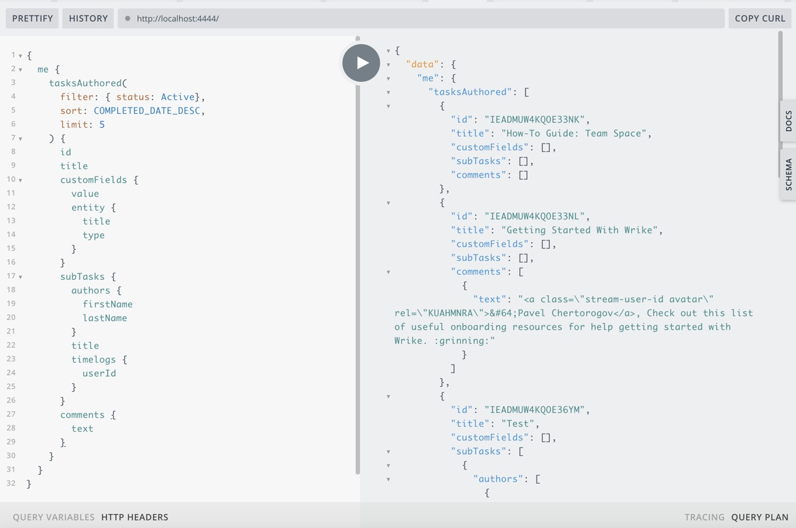

## Операция

Агрегационный запрос (порядка 15 запросов к РЕСТ АПИ) который выдергивает:
- последние 5 активных задач текущего пользователя
- к каждому заданию:
  - кастомные поля со значением и их описанием
  - заголовки подзадач с именами авторов и таймлоги
  - текст комментариев

Важно отметить, что человек который пишет вложенный запрос не указывает ни одного ID энтити. Подзапросы автоматом подтягивают необходимые данные с родительских объектов и составляют необходимые РЕСТ АПИ запросы.



## Запрос

```graphql
{
  me {
    tasksAuthored(
      filter: { status: Active},
      sort: COMPLETED_DATE_DESC,
      limit: 5
    ) {
      id
      title
      customFields {
        value
        entity {
          title
          type
        }
      }
      subTasks {
        authors {
          firstName
          lastName
        }
        title
        timelogs {
          userId
        }
      }
      comments {
        text
      }
    }
  }
}
```

## Ответ

```json
{
  "data": {
    "me": {
      "tasksAuthored": [
        {
          "id": "IEADMUW4KQOE33NK",
          "title": "How-To Guide: Team Space",
          "customFields": [],
          "subTasks": [],
          "comments": []
        },
        {
          "id": "IEADMUW4KQOE33NL",
          "title": "Getting Started With Wrike",
          "customFields": [],
          "subTasks": [],
          "comments": [
            {
              "text": "<a class=\"stream-user-id avatar\" rel=\"KUAHMNRA\">&#64;Pavel Chertorogov</a>, Check out this list of useful onboarding resources for help getting started with Wrike. :grinning:"
            }
          ]
        },
        {
          "id": "IEADMUW4KQOE36YM",
          "title": "Test",
          "customFields": [],
          "subTasks": [
            {
              "authors": [
                {
                  "firstName": "Pavel",
                  "lastName": "Chertorogov"
                }
              ],
              "title": "Sub-task1",
              "timelogs": []
            },
            {
              "authors": [
                {
                  "firstName": "Pavel",
                  "lastName": "Chertorogov"
                }
              ],
              "title": "Sub-task2",
              "timelogs": []
            }
          ],
          "comments": [
            {
              "text": "Comment 2"
            },
            {
              "text": "Comment1"
            }
          ]
        },
        {
          "id": "IEADMUW4KQOE4AD6",
          "title": "Try to fetch tasks via REST API",
          "customFields": [
            {
              "value": "https://github.com/nodkz/wrike-graphql/issues/1",
              "entity": {
                "title": "gihubIssue",
                "type": "Text"
              }
            }
          ],
          "subTasks": [
            {
              "authors": [
                {
                  "firstName": "Pavel",
                  "lastName": "Chertorogov"
                }
              ],
              "title": "SubTask123",
              "timelogs": []
            },
            {
              "authors": [
                {
                  "firstName": "Pavel",
                  "lastName": "Chertorogov"
                }
              ],
              "title": "SubTask444",
              "timelogs": []
            }
          ],
          "comments": []
        },
        {
          "id": "IEADMUW4KQOE33NJ",
          "title": "How-To Guide: Personal Space 123",
          "customFields": [],
          "subTasks": [],
          "comments": []
        }
      ]
    }
  }
}
```

## Лог REST API вызовы

```bash
  axios:request ⬜️  get https://www.wrike.com/api/v4/contacts?me=true
  axios:request ✅  get /contacts
  axios:request     me=true +2s
  axios:request ⬜️  get https://www.wrike.com/api/v4/tasks?status=Active&authors=%5B%22KUAHMNRA%22%5D&limit=5&sortField=CompletedDate&sortOrder=Desc&fields=%5B%22subTaskIds%22%2C%22customFields%22%5D +22ms
  axios:request ✅  get /tasks
  axios:request     status=Active
  axios:request     authors=["KUAHMNRA"]
  axios:request     limit=5
  axios:request     sortField=CompletedDate
  axios:request     sortOrder=Desc
  axios:request     fields=["subTaskIds","customFields"] +2s
  axios:request ⬜️  get https://www.wrike.com/api/v4/tasks/IEADMUW4KQOE33NK/comments? +4ms
  axios:request ⬜️  get https://www.wrike.com/api/v4/tasks/IEADMUW4KQOE33NL/comments? +0ms
  axios:request ⬜️  get https://www.wrike.com/api/v4/tasks/IEADMUW4KQOE36YM/comments? +0ms
  axios:request ⬜️  get https://www.wrike.com/api/v4/tasks/IEADMUW4KQOE4AD6/comments? +0ms
  axios:request ⬜️  get https://www.wrike.com/api/v4/tasks/IEADMUW4KQOE33NJ/comments? +0ms
  axios:request ⬜️  get https://www.wrike.com/api/v4/tasks/IEADMUW4KQPJTY5G,IEADMUW4KQPJTY5J,IEADMUW4KQPKIQPB,IEADMUW4KQPKIQPS? +21ms
  axios:request ⬜️  get https://www.wrike.com/api/v4/customfields/IEADMUW4JUABMOEM +0ms
  axios:request ✅  get /tasks/IEADMUW4KQOE33NJ/comments
  axios:request     plainText=undefined +1s
  axios:request ✅  get /tasks/IEADMUW4KQOE33NK/comments
  axios:request     plainText=undefined +3ms
  axios:request ✅  get /customfields/IEADMUW4JUABMOEM +2ms
  axios:request ✅  get /tasks/IEADMUW4KQOE36YM/comments
  axios:request     plainText=undefined +5ms
  axios:request ✅  get /tasks/IEADMUW4KQOE4AD6/comments
  axios:request     plainText=undefined +3ms
  axios:request ✅  get /tasks/IEADMUW4KQPJTY5G,IEADMUW4KQPJTY5J,IEADMUW4KQPKIQPB,IEADMUW4KQPKIQPS +2ms
  axios:request ⬜️  get https://www.wrike.com/api/v4/tasks/IEADMUW4KQPJTY5G/timelogs? +3ms
  axios:request ⬜️  get https://www.wrike.com/api/v4/tasks/IEADMUW4KQPJTY5J/timelogs? +0ms
  axios:request ⬜️  get https://www.wrike.com/api/v4/tasks/IEADMUW4KQPKIQPB/timelogs? +0ms
  axios:request ⬜️  get https://www.wrike.com/api/v4/tasks/IEADMUW4KQPKIQPS/timelogs? +15ms
  axios:request ⬜️  get https://www.wrike.com/api/v4/contacts/KUAHMNRA? +16ms
  axios:request ✅  get /tasks/IEADMUW4KQOE33NL/comments
  axios:request     plainText=undefined +2ms
  axios:request ✅  get /tasks/IEADMUW4KQPJTY5J/timelogs
  axios:request     plainText=undefined +925ms
  axios:request ✅  get /contacts/KUAHMNRA +12ms
  axios:request ✅  get /tasks/IEADMUW4KQPJTY5G/timelogs
  axios:request     plainText=undefined +22ms
  axios:request ✅  get /tasks/IEADMUW4KQPKIQPS/timelogs
  axios:request     plainText=undefined +4ms
  axios:request ✅  get /tasks/IEADMUW4KQPKIQPB/timelogs
  axios:request     plainText=undefined +1s
```
